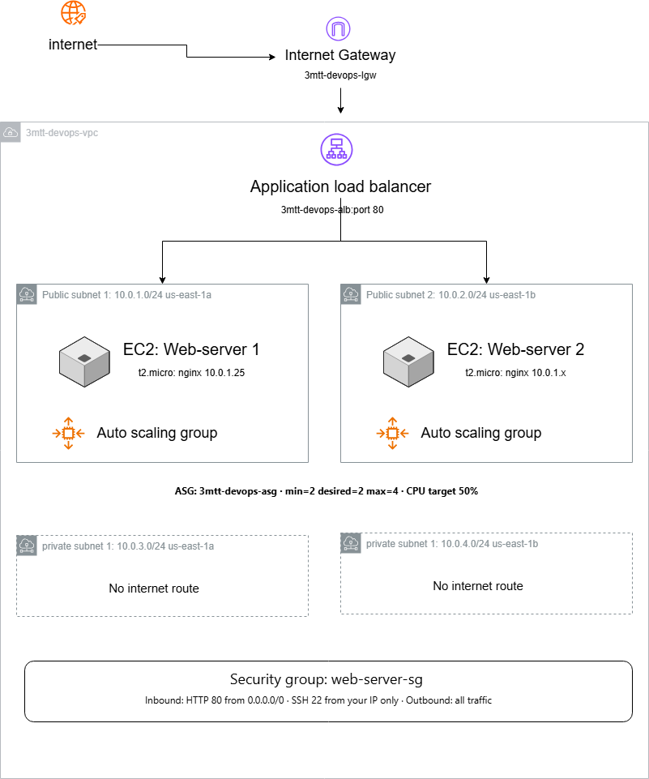

# Week 4 Architecture — AWS VPC & Load Balancing

## Architecture Diagram

## Architecture Overview
...

Internet
↓
Internet Gateway (3mtt-devops-igw)
↓
Application Load Balancer (port 80)
↓
Target Group (3mtt-devops-tg)
↙        ↘
web-server-1  web-server-2
(nginx)       (nginx)
Public Sub 1  Public Sub 2
10.0.1.0/24   10.0.2.0/24
|               |
└── Auto Scaling Group ──┘
min=2  desired=2  max=4

---

## VPC CIDR Ranges

| Resource | Name | CIDR | AZ |
|---|---|---|---|
| VPC | 3mtt-devops-vpc | 10.0.0.0/16 | — |
| Public Subnet 1 | public-subnet-1 | 10.0.1.0/24 | us-east-1a |
| Public Subnet 2 | public-subnet-2 | 10.0.2.0/24 | us-east-1b |
| Private Subnet 1 | private-subnet-1 | 10.0.3.0/24 | us-east-1a |
| Private Subnet 2 | private-subnet-2 | 10.0.4.0/24 | us-east-1b |

---

## Route Tables

### Public Route Table
| Destination | Target |
|---|---|
| 10.0.0.0/16 | local |
| 0.0.0.0/0 | 3mtt-devops-igw |

### Private Route Table
| Destination | Target |
|---|---|
| 10.0.0.0/16 | local |

Private subnets have no internet route — they cannot be reached from
or reach the internet directly.

---

## Security Group Rules

### web-server-sg

**Inbound:**
| Type | Protocol | Port | Source | Reason |
|---|---|---|---|---|
| HTTP | TCP | 80 | 0.0.0.0/0 | Allow web traffic from anywhere |
| SSH | TCP | 22 | My IP/32 | Restrict SSH to my machine only |

**Outbound:**
| Type | Protocol | Port | Destination |
|---|---|---|---|
| All traffic | All | All | 0.0.0.0/0 |

---

## Auto Scaling Group

| Setting | Value |
|---|---|
| Name | 3mtt-devops-asg |
| Min instances | 2 |
| Desired instances | 2 |
| Max instances | 4 |
| Scaling policy | Target tracking — 50% CPU |
| Launch template | 3mtt-devops-lt (Ubuntu 22.04, t2.micro, nginx) |

---

## What Happens When One Instance Fails

1. The EC2 instance stops responding to traffic
2. The ALB health check detects the instance is unhealthy
   (after 2 failed checks, ~10 seconds)
3. The ALB immediately stops sending traffic to that instance
4. All traffic is routed to the remaining healthy instance
5. The Auto Scaling Group detects the instance count
   dropped below the desired value of 2
6. ASG automatically launches a replacement EC2 instance
   using the Launch Template
7. The new instance installs nginx via User Data on boot
8. Once the new instance passes health checks it is added
   back to the Target Group
9. ALB resumes distributing traffic across both instances

**Result:** Users experience no downtime. The ALB handles
failover in seconds; ASG restores full capacity in ~3 minutes.

---

## Resources Created

| Resource | Name | Purpose |
|---|---|---|
| VPC | 3mtt-devops-vpc | Isolated network |
| Internet Gateway | 3mtt-devops-igw | Internet access for public subnets |
| ALB | 3mtt-devops-alb | Distribute traffic across instances |
| Target Group | 3mtt-devops-tg | Health check and route to EC2s |
| ASG | 3mtt-devops-asg | Auto replace failed instances |
| Launch Template | 3mtt-devops-lt | Blueprint for new instances |
| Security Group | web-server-sg | Control inbound/outbound traffic |

---

## Tags

All resources are tagged with `Project: 3mtt-devops`
